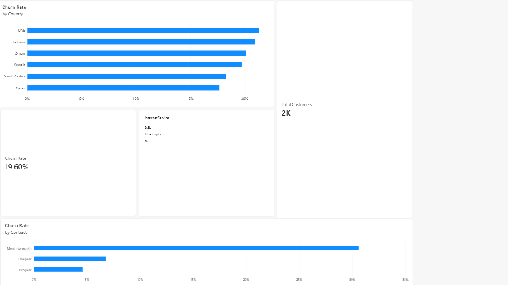

# customer-churn-power-bi-dashboard
customer churn
# Customer Churn Analysis – Power BI

## 📊 Project Overview

This project analyzes customer churn using **Power BI** to identify customer segments and factors associated with customer attrition.

The dashboard provides an interactive overview of churn rates across different countries, contract types, and internet service categories.
**Data:** Sample (synthetic) dataset, 2,000 customers.

**Key finding:** Month-to-month customers churn the most (about 30%).

## 🛠️ Tools & Technologies

- Power BI
- DAX
- Power Query
- Data Visualization
- Microsoft Excel / CSV

## 📈 Dashboard Analysis

The dashboard includes:

- Overall Customer Churn Rate
- Total Customer Count
- Churn Rate by Country
- Churn Rate by Contract Type
- Internet Service Analysis
- Customer Churn KPIs

## 🔍 Key Objectives

- Measure the overall customer churn rate
- Identify countries with higher churn rates
- Compare churn across different contract types
- Analyze customer service categories
- Create an interactive dashboard for business insights

## 📷 Dashboard Preview

## 📁 Project Files

- `customer_churn_dashboard_power_BI.pbix` – Power BI dashboard
- `dashboard.png` – Dashboard screenshot

## 💡 Skills Demonstrated

- Data Cleaning
- Data Transformation
- DAX Calculations
- KPI Development
- Data Visualization
- Business Analysis
- Power BI Dashboard Development

## 👤 Author

**Yusuf Naharpura**

GitHub: [YusufNaharpura](https://github.com/YusufNaharpura)
